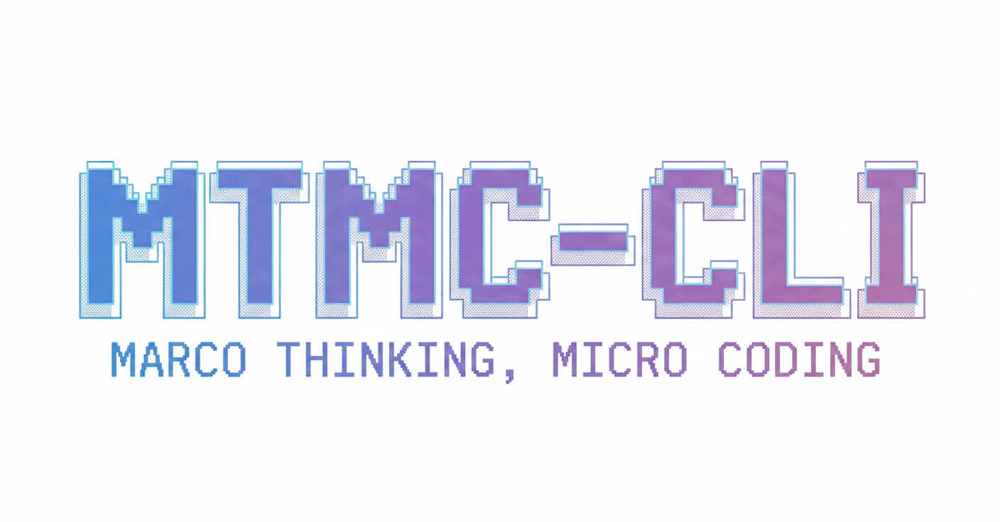

<div align="center">

</div>

<p align="center">
  <a href="https://github.com/AKatydid/mtmc-cli/blob/main/LICENSE">
    
  </a>
</p>

MTMC-CLI is an open-source kernel generation agent based on the “Macro Thinking, Micro Coding” paradigm, running directly in your terminal. 
It provides lightweight access to macro-level reasoning and micro-level kernel coding within agent-driven loops. 

## RoadMap  
- [ ] CI Process
- [ ] Integration with automated performance evaluation and profiling tools  
- [ ] Multi-backend kernel generation (e.g., CUDA, Triton, other accelerators)  
- [ ] Benchmarking and reproducibility utilities for generated kernels  

## Usage
First, clone the repo and enter the directory.
```bash
git clone https://github.com/AKatydid/mtmc-cli.git
cd mtmc-cli
```

Then, install dependencies and build the project.
```bash
npm install
npm run build
npm link
```

Finally, run MTMC-CLI in your terminal, just key in `mtmc`.
```bash
mtmc
```

## License
This project is licensed under the **Apache License 2.0**.  
See the [LICENSE](./LICENSE) file for details.

## Acknowledge
MTMC-CLI is inspired by the excellent open-source project **[google-gemini/gemini-cli](https://github.com/google-gemini/gemini-cli)**.  
We thank the Gemini CLI team for providing a clean and well-designed foundation for building agent-driven CLI tools.

